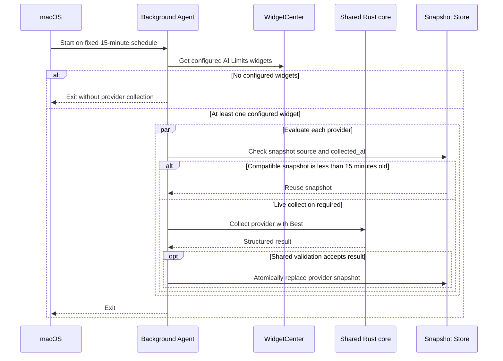

# Background Agent

This document defines the planned headless collection component and its runtime lifecycle.

Related:

- runtime relationships: [runtime-architecture.md](runtime-architecture.md)
- snapshot persistence: [snapshot-store.md](snapshot-store.md)
- shared source selection: [get-limits/source-chains.md](get-limits/source-chains.md)

---

## Purpose

Background Agent refreshes provider snapshots independently from the Tauri process.

It is a planned short-lived Rust process with no window and no Dock presence.

---

## Responsibilities

The agent:

- runs on a fixed 15-minute macOS schedule
- checks whether the user has configured any AI Limits widgets before provider collection
- uses the fixed `Best` source strategy
- evaluates Codex, Claude, and Cursor in the same scheduled run
- reuses a source-compatible snapshot collected less than 15 minutes before the run
- calls the same shared Rust core as CLI and Tauri
- writes acceptable structured results to Snapshot Store
- leaves previous snapshots unchanged after failed or unusable results
- exits after the scheduled collection run

If no AI Limits widgets are configured, the agent exits without starting provider collection. The agent does not inspect whether Tauri is running.

The agent first attempts to discover configured widgets through `WidgetCenter`. Because the agent is a Rust executable, this access is isolated behind a thin native WidgetKit bridge.

If `WidgetCenter` configuration discovery is unavailable from the LaunchAgent process, the widget extension maintains a conservative presence signal in the shared App Group whenever WidgetKit requests a non-preview timeline. The signal is operational metadata, not a provider snapshot. Its exact expiration policy is an implementation detail and must prefer a small amount of unnecessary collection over stopping updates for an installed widget.

The agent does not contain provider-specific collection logic, define source chains, validate snapshots independently, render interface output, or edit application settings.

---

## Collection Flow

Provider collection timing is independent from WidgetKit display refresh timing.

All providers share the same 15-minute agent launch. They do not have separate macOS schedules or persisted next-run state.

Because a snapshot created between agent runs may be reused at the next run, its age before replacement may approach 30 minutes. This is the accepted background freshness bound.

---

## Consent and Control

macOS starts or registers the agent only after explicit user consent.

Tauri registers the bundled user LaunchAgent through `SMAppService`. After registration and any required macOS approval, the system starts the agent automatically at user login. The user does not need to open Tauri to restore widget data collection after login.

The agent remains visible and controllable through the macOS background-items settings required by the system.

Closing Tauri does not stop or unregister the agent.

On startup, Tauri checks the `SMAppService` status. It leaves an enabled service unchanged, registers a service that is not registered, and directs the user to `Help → Permissions` when macOS approval is required.

After an application update, Tauri performs the same status check. It does not unregister and register an enabled service merely because the app bundle version changed.

If the agent process is terminated without disabling its service, macOS may start it again according to the registered schedule and starts the registered LaunchAgent again after the user's next login.

If the user disables the background item or macOS denies or withdraws approval, Tauri does not silently override that choice. `Help → Permissions` explains the state and provides the macOS-only action for opening the relevant System Settings page.

The LaunchAgent schedule is fixed and does not use the per-provider refresh intervals configured for the active Tauri interface.

---

## Accepted Decisions

- implement collection as a headless Rust component that reuses the shared core
- use the fixed `Best` source strategy
- use API2 as the Cursor source
- use CLI-first chains with local fallback for Codex and Claude
- write only results accepted by shared data validation
- run without a window or Dock presence
- require explicit user consent before background registration
- package the process as a user LaunchAgent inside the application bundle
- register and unregister the agent through `SMAppService`
- start the registered agent automatically at user login
- keep background collection independent from Tauri after registration
- keep closing Tauri independent from agent registration and execution
- check the agent service status whenever Tauri starts
- register an unregistered service from Tauri
- do not silently re-enable a background item disabled or denied by the user
- route approval and background-item problems to `Help → Permissions`
- run every 15 minutes regardless of whether Tauri is running
- evaluate every supported provider within the same scheduled run and exit afterward
- reuse only snapshots compatible with the fixed `Best` strategy and collected less than 15 minutes before the run
- accept background snapshot freshness up to 30 minutes
- keep one shared agent schedule without per-provider launch times
- keep active Tauri refresh intervals separate from the fixed background schedule
- skip all provider collection when WidgetCenter reports no configured AI Limits widgets
- access WidgetCenter through a thin native bridge
- use a conservative App Group widget-presence signal if WidgetCenter configuration discovery is unavailable from the LaunchAgent process
- preserve an enabled agent registration across application updates
- apply the normal startup status check after an application update
- do not add collection coordination with Tauri beyond Snapshot Store reuse and last-writer-wins atomic replacement

---

## Implementation Verification

- verify direct WidgetCenter configuration discovery from the LaunchAgent process
- verify that replacing the application bundle preserves the registered agent and starts the new bundled executable
