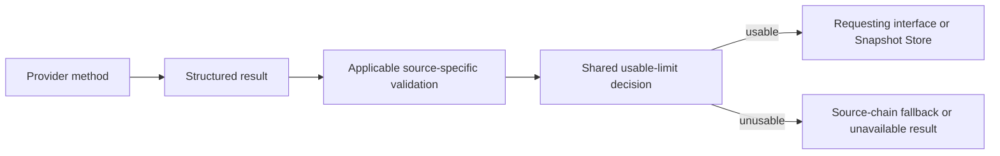

# Data Validation

This document is the source of truth for deciding whether a structured provider result contains usable limit data.

Related contracts:

- structured field meanings: [structured-info-rules.md](structured-info-rules.md)
- structured field schema: [structured-info-schema.md](structured-info-schema.md)
- source order and fallback chains: [source-chains.md](source-chains.md)
- local-file quality and freshness rules: [methods/local-files-data-quality.md](methods/local-files-data-quality.md)

---

## Validation Flow

Provider methods produce the common structured contract. Applicable source-specific validation runs before the shared usable-limit decision. Consumers use the shared decision and must not implement competing definitions of valid limit data.

---

## Usable Limit Data

A structured result contains usable limit data only when:

- `status.access_available` is `true`
- `status.data_available` is `true`
- at least one limit record is present
- all applicable source-specific quality and freshness validation has passed

The presence of diagnostics alone does not make an otherwise usable result invalid.

---

## Source-Specific Validation

Source-specific rules remain in the documentation for the affected method or source type. They are not duplicated here.

A failed source-specific check must affect the structured result before the shared usable-limit decision. The result must not remain classified as usable after validation has rejected its current limit data.

Current local-file quality and freshness rules are documented in [methods/local-files-data-quality.md](methods/local-files-data-quality.md).

---

## Consumer Rules

- source-chain selection tries the next source after an unusable result
- Snapshot Store replaces a provider snapshot only after a usable result
- interfaces may present an unavailable or no-current-data state from an unusable result
- consumers do not reinterpret diagnostics or provider-specific fields to create their own validity decision

The complete `StructuredSourceInfo` remains available after validation. Consumers select the fields needed for their presentation but do not redefine data validity.

---

## Extension Rule

New common validation belongs in this document and in the shared usable-limit implementation.

New source-specific validation belongs in the affected source documentation and implementation, with a link from this document when the rule is relevant across interfaces.
