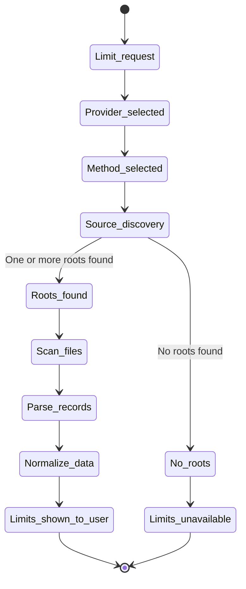

# Local Files Data Quality

## Source Discovery and Scan

The diagram below describes local-file discovery and scan behavior.

---

## Data Quality and Freshness

These source-specific rules feed the shared usable-limit decision documented in [../data-validation.md](../data-validation.md).

- data quality must include source type, timestamp of latest relevant record, and confidence level
- if the latest relevant record is older than the configured staleness threshold, mark data as stale
- if a reliably parsed automatic limit reset is more than two minutes in the past, reject the whole local current-limit snapshot
- if files exist but no relevant records are found, return a clear `no data found` result
- if roots are missing, return a clear `source not found` result with searched roots
