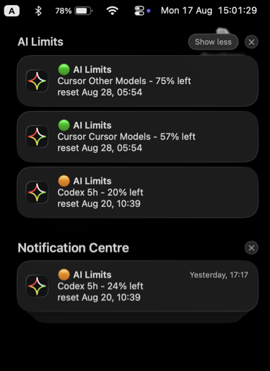
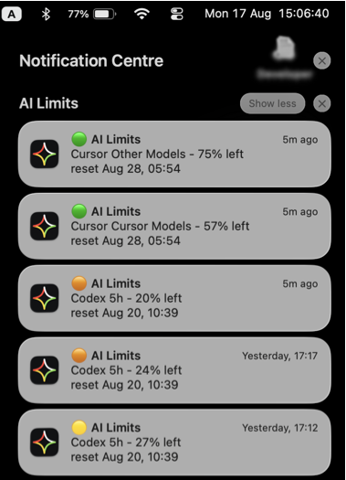

# ai-limits

| <a href="DE.md">DE</a> | <a href="../../README.md">EN</a> | ES | <a href="FR.md">FR</a> | <a href="PT.md">PT</a> | <a href="RU.md">RU</a> | <a href="ZH.md">中文</a> | <a href="AR.md">عربي</a> |

   Aplicación local para controlar los límites y el uso de las suscripciones de IA en Codex, Claude y Cursor.

  
  
  

<a href="https://github.com/md2it/ai-limits/releases/tag/v0.4.0">Todas las descargas</a>

---

  
  
  
  

  
  
  
  

## Ventajas

- Funciona sin suscripción a la API,
- Sin cuenta independiente de AI Limits: usa la autorización existente del proveedor,
- Todos los proveedores en un solo lugar,
- Completamente gratuita,
- Privada. Sin servicios de terceros, proxies ni registros,
- Aplicación de escritorio ligera para Mac, Windows y Linux,
- Notificaciones de límites,
- Código abierto.

## Funciones

- Muestra los límites, la fecha y hora de reinicio, los tokens disponibles y los reinicios manuales disponibles,
- Funciona con Codex, Claude y Cursor,
- Obtiene los datos de archivos locales, CLI de los proveedores y APIs,
- Lógica de respaldo: si una fuente no está disponible, comprueba otra,
- Aplicación de escritorio ligera (macOS, Windows, Linux),
- Interfaz CLI con varios formatos de salida,
- Notificaciones del sistema al alcanzar umbrales de límite,
- Actualización manual de todos los datos y una frecuencia automática compartida.

## Alternativas

| | **ai-limits** | [CodexBar](https://github.com/steipete/CodexBar) | [caut](https://github.com/Dicklesworthstone/coding_agent_usage_tracker) |
| --- | :---: | :---: | :---: |
| App de escritorio y CLI | ✅ | ✅ | ❌ |
| Codex, Claude y Cursor | ✅ | ✅ | ✅ |
| macOS, Windows y Linux | ✅ | ❌ | ❌ |
| Sin servicio intermediario | ✅ | ✅ | ✅ |

La comparación completa de 18 alternativas y 16 criterios está en el [catálogo de alternativas](../product/analogues.tsv).

## Compatibilidad de plataformas y limitaciones

- macOS: versión compatible; la aplicación está firmada, notarizada y con ticket adjunto; las notificaciones funcionan,
- Windows y Linux: hay builds preliminares sin firmar disponibles; el soporte evoluciona según los comentarios de los usuarios,
- Las notificaciones de la aplicación de escritorio solo están disponibles por ahora en macOS,
- Algunas fuentes locales de Codex y Claude pueden no funcionar aún en Windows y Linux (las fuentes a través de CLI funcionan en todas partes),
- Las fuentes CLI de Codex y Claude requieren autorización con el proveedor correspondiente; Cursor requiere un token válido de Cursor Agent autorizado.

## Licencia

[Licencia MIT](../../LICENSE)
