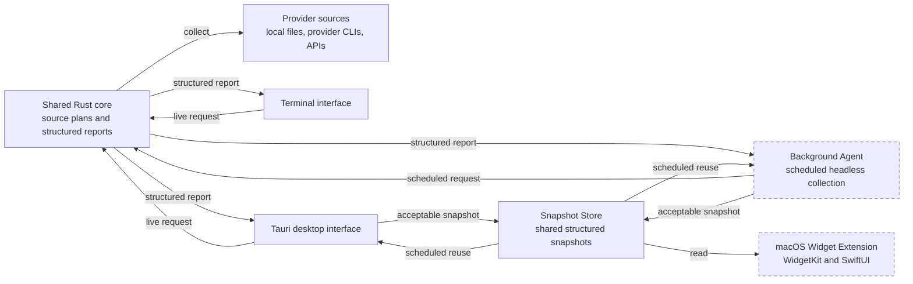
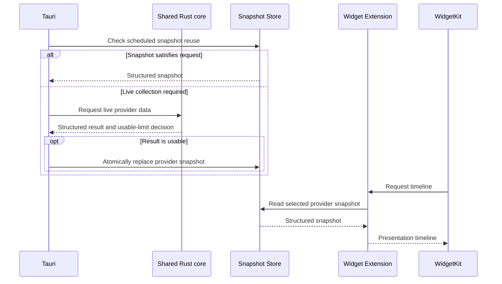

# Runtime Architecture

This document defines the runtime map, component relationships, shared state boundaries, and cross-component information flows of AI Limits. Code ownership and module boundaries are documented in [architecture.md](architecture.md).

---

## Status Notation

Solid component borders indicate implemented components. Dashed component borders indicate planned components that are not yet implemented.

A connection to a planned component is also planned even when the originating component already exists.

---

## Runtime Map

---

## Component Boundaries

### Shared Rust Core

The shared core owns provider collection, source plans, fallback, normalization, and the usable-limit decision. It does not schedule future runs, persist snapshots, or depend on an interface.

Data validation is documented in [get-limits/data-validation.md](get-limits/data-validation.md).

### Terminal Interface

CLI performs a live request, maps the structured result to terminal presentation, and exits. It remains stateless and does not implicitly read desktop settings or Snapshot Store.

Terminal behavior is documented in [terminal/interface.md](terminal/interface.md).

### Tauri Desktop Interface

Tauri owns interactive desktop behavior, frontend-local settings, live manual refresh, and active-window schedules. Scheduled refresh may reuse a fresh source-compatible snapshot, while manual refresh remains live. Provider refreshes remain independent.

Desktop architecture is documented in [desktop/architecture.md](desktop/architecture.md).

### Background Agent

Background Agent is the planned short-lived Rust process that performs live collection on a fixed 15-minute schedule independently from Tauri.

Its lifecycle and responsibilities are documented in [background-agent.md](background-agent.md).

### Snapshot Store

Snapshot Store persists the latest acceptable structured result per provider. It does not collect providers or define validity.

Its contract, App Group layout, and replacement rules are documented in [snapshot-store.md](snapshot-store.md).

### macOS Widget Extension

Widget Extension reads provider snapshots, applies a thin presentation mapping, and returns timelines to WidgetKit. It does not collect provider data.

Widget runtime behavior is documented in [widgets/architecture.md](widgets/architecture.md).

---

## Main Information Flow

Provider collection timing and WidgetKit display refresh timing are separate concerns.

---

## Cross-Component Coordination

- provider refreshes are independent across providers
- Tauri and Background Agent use the same shared core and validation
- Snapshot Store performs atomic per-provider replacement
- failed or unusable collection leaves the previous snapshot unchanged
- scheduled Tauri refresh may reuse a fresh source-compatible snapshot
- manual Tauri refresh always performs live collection
- Background Agent uses the same fixed 15-minute launch for all providers and may reuse snapshots compatible with `Best`
- Tauri and Background Agent request one affected WidgetKit timeline reload after a collection batch only when user-visible data changed
- WidgetKit chooses actual widget execution and display refresh times

Component-specific coordination decisions belong to the owning documents linked above.

---

## Sources of Truth

- provider retrieval, fallback, and normalized structured data: shared Rust core
- usable-limit decision: [get-limits/data-validation.md](get-limits/data-validation.md)
- source order: [get-limits/source-chains.md](get-limits/source-chains.md)
- current live request result: the caller that initiated the request
- last acceptable persisted result: Snapshot Store
- desktop settings: Tauri frontend state
- background schedule execution: Background Agent
- active Tauri timers and transient UI state: Tauri frontend memory
- widget presentation and requested timeline: Widget Extension
- actual widget execution time: WidgetKit

---

## Cross-Component Decisions

- keep one shared Rust core for CLI, Tauri, and Background Agent
- persist canonical structured data rather than interface-specific display models
- keep CLI stateless and independent of desktop settings
- let scheduled Tauri refresh reuse source-compatible snapshots without changing source-chain semantics
- keep manual Tauri refresh live
- keep provider collection outside Widget Extension
