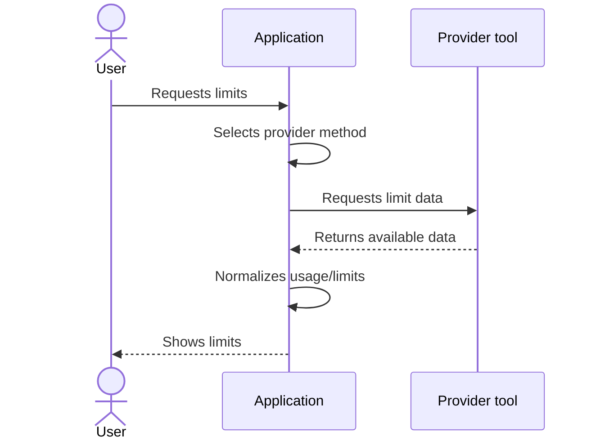

# Getting Limits Through Provider CLI

This document describes provider methods that fetch usage/limits through the local CLI or the provider's local client tool.

---

## Base Flow

The diagram below describes the general process for a provider method that uses the local CLI or local client tool.

---

## Rules

- each provider may have multiple provider methods
- the application selects the primary available method and may use a fallback if the primary method is unavailable
- for interactive CLIs, the application spawns a fresh virtual terminal process for each request and drives it through the whole exchange
- the virtual terminal process is not reused across requests; the application waits for it to exit or kills it before returning
- the application must not leave background terminals or provider CLI sessions running after it exits

---

## Deviations From the Flow

- if no matching CLI or local tool exists for the required provider, the application shows a clear error and next step
- if the CLI returned no response, the application shows an appropriate error
- if the response format could not be parsed, the application shows an appropriate error
- if a provider method requires a sensitive token, cookie, or additional login, the application must not perform the action without explicit user consent

When a provider CLI is installed but is not authorized, the application must explain that authorization is required and offer the provider's login command as the next step. The desktop application may offer an explicit sign-in action; the terminal interface must print the manual command only. Neither interface may start authorization or open a browser until the user explicitly chooses the desktop sign-in action.
