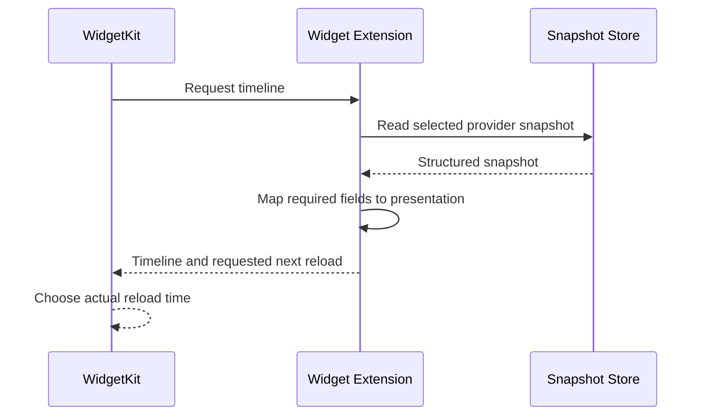

# macOS Widget Architecture

This document defines the planned WidgetKit component, its data boundary, and its runtime behavior.

Related:

- runtime relationships: [../runtime-architecture.md](../runtime-architecture.md)
- snapshot contract and App Group: [../snapshot-store.md](../snapshot-store.md)
- shared data validation: [../get-limits/data-validation.md](../get-limits/data-validation.md)

---

## Purpose

The macOS Widget Extension displays the latest acceptable provider limits without running provider collection.

The native scaffold is implemented with SwiftUI and WidgetKit under `src-macos-widgets/`. It currently renders placeholder content and establishes only the extension, App Group, timeline, and native bridge boundaries.

---

## Responsibilities

The extension:

- reads the selected provider snapshot from the shared App Group
- decodes the shared structured contract
- maps only required structured fields to WidgetKit presentation models
- displays limit values and snapshot age
- displays stale stored data instead of discarding it when background collection is unavailable
- provides an `Enable automatic updates` action when stored data is no longer being refreshed
- returns a timeline and requested future reload time to WidgetKit

The extension does not launch provider CLIs, read arbitrary provider files, choose provider source chains, duplicate limit semantics, or define data validity.

---

## Display Flow

WidgetKit controls the actual execution and display refresh time. A requested time is a preference, not a guarantee.

The widget remains able to display the previous snapshot when neither Tauri nor Background Agent is currently running.

When stored data is stale, the widget identifies it as stale and may show `Enable automatic updates`. The action opens Tauri at `Help → Permissions`; Tauri owns agent status checks, registration, and links to macOS System Settings. The widget does not register or enable the agent directly.

Disabling background collection or withdrawing macOS approval does not delete acceptable snapshots. No separate expiration removes the last acceptable snapshot from the widget.

---

## Snapshot Reading

Widget Extension follows the snapshot compatibility and failure policy defined in [../snapshot-store.md](../snapshot-store.md). It does not reinterpret diagnostics or provider-specific fields to redefine validity.

Background Agent uses WidgetCenter configuration discovery to skip provider collection when the user has no configured AI Limits widgets. Agent behavior is documented in [../background-agent.md](../background-agent.md).

If direct WidgetCenter discovery is unavailable from the LaunchAgent process, a non-preview timeline request updates the conservative widget-presence signal defined by the Background Agent contract.

After a producer finishes a collection batch, it asks WidgetKit to reload the affected widget timelines once when user-visible values or status changed. It does not request a reload after every provider write or when only snapshot collection time changed.

Timeline policy remains the fallback when an explicit reload request is unavailable, delayed, or rejected by WidgetKit.

---

## Accepted Decisions

- keep provider collection outside Widget Extension
- use the shared App Group snapshot files
- decode the complete structured contract and map only fields required by the widget
- let WidgetKit control actual timeline execution
- preserve and identify the last acceptable snapshot when automatic collection is unavailable
- route automatic-update recovery through Tauri `Help → Permissions`
- use a thin native WidgetKit bridge for producer reload requests
- request at most one affected-timeline reload after a completed collection batch
- request immediate reload only for changes visible to the user
- retain the normal WidgetKit timeline as the fallback update mechanism

## Current Scaffold

The Xcode project builds `AI Limits Widgets.appex` with bundle identifier `com.ai-limits.desktop.widgets` and embeds it under `AI Limits.app/Contents/PlugIns/`.

`AILimitsWidgetBridge` is the native bridge placeholder. It exposes the shared App Group container lookup and the affected WidgetKit timeline reload call; it is not connected to Tauri or the planned Background Agent yet.

The placeholder timeline does not read snapshots, configure providers, or implement the final presentation. Those remain future work under the responsibilities and contracts above.

Run `scripts/build-macos-app-with-widgets.sh` on macOS for an unsigned local universal app build. The signed CI validation procedure is documented in [../devops/builds.md](../devops/builds.md).
